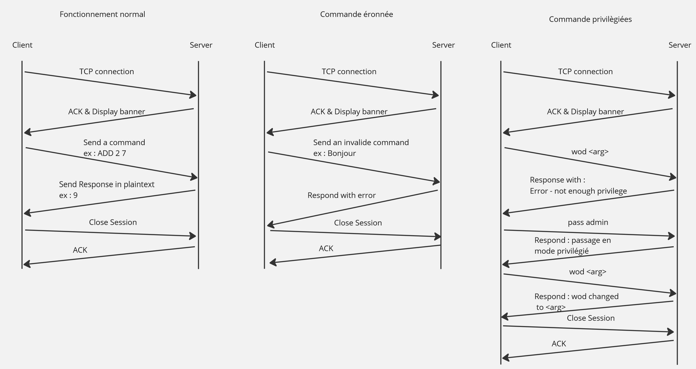

# Protocole FBP
## Romain Fleury, Dr. Ing. Julien Billeter

### Vue générale
FBP : client se connecte au serveur. Le client envoie une commande (avec ou sans arguments), et le serveur envoie une réponse ou un message d'erreur si la commande n'est pas reconnue (ou que les arguments de la commande ne sont pas valides).
Le client peut s'authentifier pour accéder à des commandes privilégiées.


### Protocole de la couche Transport
Le protocole FBP utilise TCP comme protocole de transport. Le client établit une connexion TCP avec le serveur sur une adresse IP donnée et le serveur écoute sur le port 1234.
Le client envoie la commande ``` xxx ``` pour fermer la connexion. Le serveur n'a pas de *timeout*.

### Messages
Les commandes suivantes sont supportées par le serveur :

#### Commandes invité/utilisateur
- ```help``` : retourne la liste des commandes disponibles
- ```ping``` : retourne ```pong```
- ```add <arg1> <arg2>``` : retourne le résultat de ```<arg1> + <arg2>```
- ```sub <arg1> <arg2>``` :
- ```mult <arg1> <arg2>``` :
- ```div <dividende> <diviseur>``` :
- ```neg <arg1>``` :
- ```root <base> <exposant>``` :
- ```pow <base> <expostant>``` :
- ```admin <mot de passe>``` : permet de basculer en mode administrateur
- ```wod``` : affiche le message du jour

#### Commandes privilégiées/administrateur

En plus des commandes utilisateur, les commandes suivantes sont accessibles à l'administrateur une fois authentifié :
- ```wod <arg1>``` : change le message du jour pour ```<arg1>```
- ```exit``` : quitte le mode privilégié et revient au mode invité
- ```quit``` : alias de ```exit```

### Exemples de dialogues

